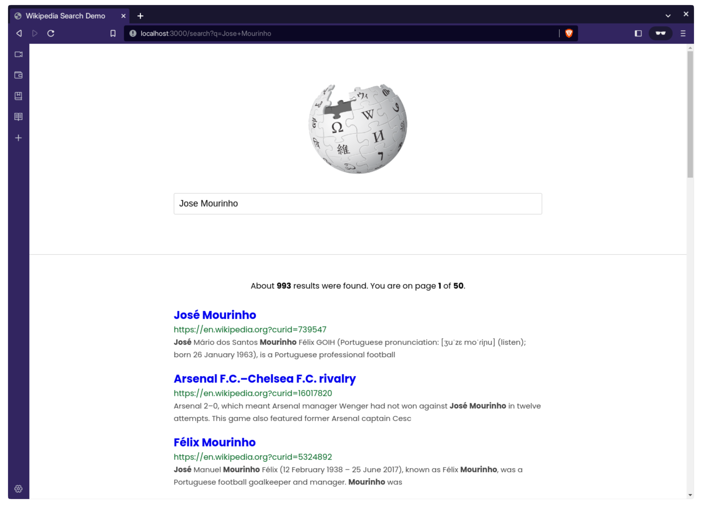
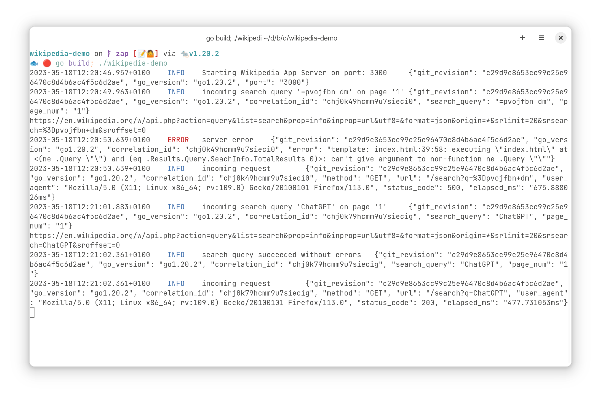

# Logging in Go

This repository contains examples of
[Logging with Zerolog](https://github.com/betterstack-community/wikipedia-demo/tree/zerolog)
and
[Logging with Zap](https://github.com/betterstack-community/wikipedia-demo/tree/zap),
and
[Logging with Slog](https://github.com/betterstack-community/wikipedia-demo/tree/slog)
in a simple Go web application (Wikipedia Search) to give you an idea of how you
can get started with logging in your own projects.

Here are the accompanying tutorials for each package:

- [A Complete Guide to Logging in Go with Zerolog](https://betterstack.com/community/guides/logging/zerolog/).
- [A Comprehensive Guide to Zap Logging in Go](https://betterstack.com/community/guides/logging/zerolog/).
- [A Comprehensive Guide to Logging in Go with Slog](https://betterstack.com/community/guides/logging/logging-in-go/).





## 🟢 Prerequisites

You must have the [latest version of Go](https://go.dev/doc/install) installed
on your machine. This project was tested against v1.20.

## 📦 Getting started

- Clone this repo to your machine:

```bash
git clone https://github.com/betterstack-community/go-logging
```

- `cd` into the project folder and switch to the relevant branch:

```bash
cd go-loggig
```

```bash
git checkout zerolog
# or
git checkout zap
# or
git checkout slog
```

- Run `go mod tidy` to download dependencies.
- Execute the command below to start the development server on port 3000:

```bash
go build -o bin/logging && ./bin/logging
# or provide a different port like this
go build -o bin/logging && PORT=4000 ./bin/logging
```

- Visit [http://localhost:3000](http://localhost:3000) in your browser.
- Enter a search query, and view the corresponding logs in your console and in
  the `logs/app.log` file.

## ⚖ License

The code used in this project and in the linked tutorial are licensed under the
[Apache License, Version 2.0](LICENSE).
